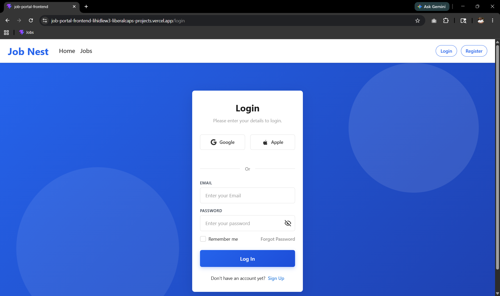
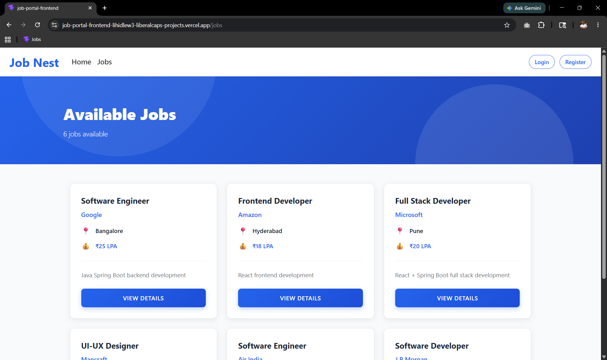
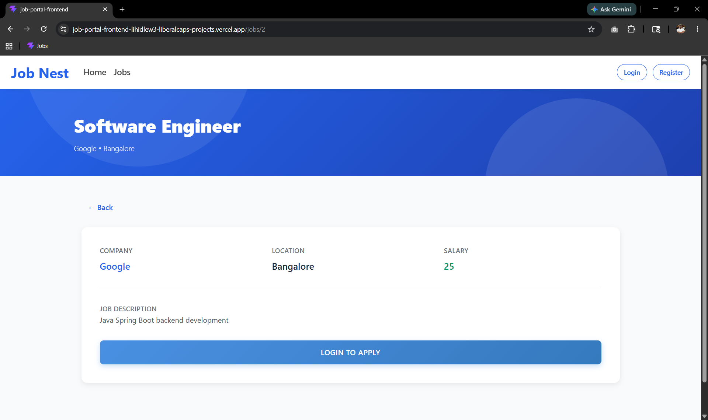
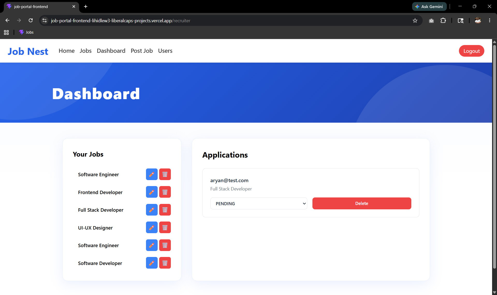
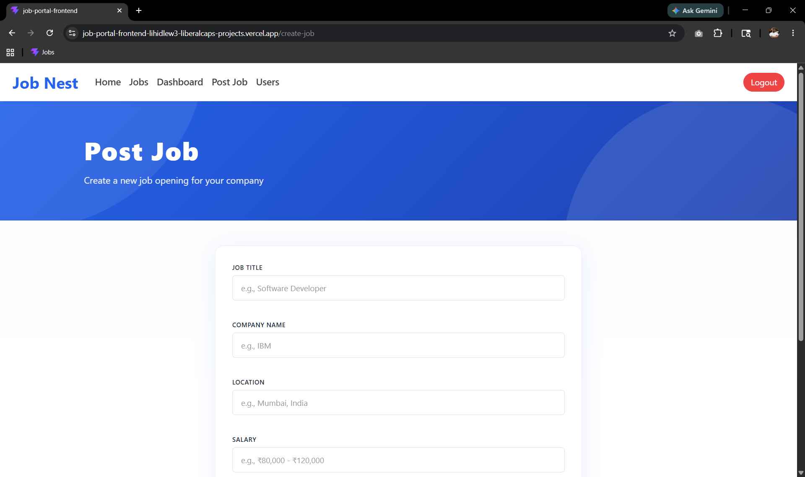
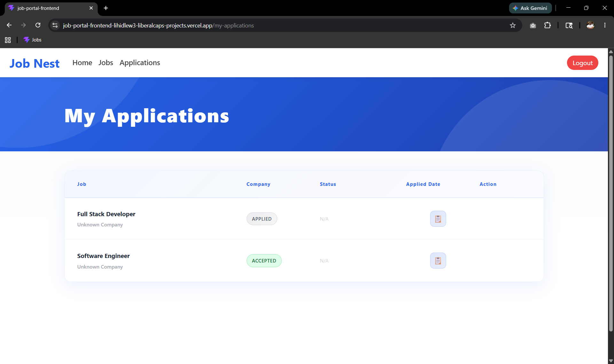
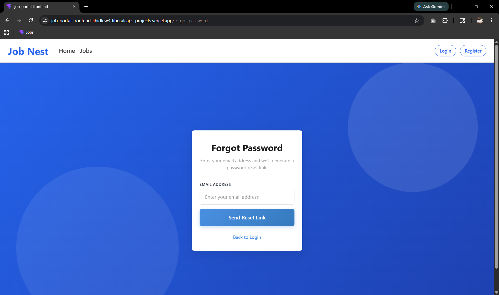

# Job Portal Frontend

A modern React-based frontend for a full-stack Job Portal application built with React, Vite, and Tailwind CSS.

The application enables job seekers to browse and apply for jobs while providing recruiters with a dedicated dashboard to create, manage, and monitor job postings through a responsive and user-friendly interface.

---

## Live Demo

**Frontend Deployment:** https://job-portal-frontend-six-pi.vercel.app/

**Frontend Repository:** https://github.com/Liberalcap/job-portal-frontend

**Backend Repository:** https://github.com/Liberalcap/job-portal-backend

---

## Features

### Authentication

- User registration and login
- Recruiter registration and login
- JWT-based authentication
- Protected routes
- Forgot password and reset password flow

### Job Seeker Features

- Browse available jobs
- View detailed job descriptions
- Apply for jobs
- Track applied jobs

### Recruiter Features

- Recruiter dashboard
- Create job postings
- Edit job postings
- Manage job listings
- View applicants and users

### UI Features

- Responsive design
- Clean and modern interface
- Loading states
- Error handling
- Role-based navigation

---

## Screenshots

### Homepage


---

### Login Page



---

### Jobs Listing Page



---

### Job Details Page



---

### Recruiter Dashboard



---

### Create Job Page



---

### My Applications Page



---

### Forgot Password Page



---

## Tech Stack

- **React.js** - Frontend UI library
- **React Router DOM** - Client-side routing
- **Axios** - HTTP client for API requests
- **Tailwind CSS** - Utility-first styling
- **Vite** - Frontend build tool and dev server

---

## Prerequisites

- **Node.js** v16 or higher
- **npm** or **yarn**
- **Git**

---

## Installation & Setup

### 1. Clone the Repository

```bash
git clone https://github.com/Liberalcap/job-portal-frontend
cd job-portal-frontend
```

### 2. Install Dependencies

```bash
npm install
# or
yarn install
```

### 3. Create Environment Variables

Create a `.env` file in the root directory:

```env
VITE_API_BASE_URL=http://localhost:8080/api
```

### 4. Start Development Server

```bash
npm run dev
# or
yarn dev
```

The application will be available at `http://localhost:5173`.

> **Note:** Environment variables must be prefixed with `VITE_` to be accessible in the frontend.

---

## Available Scripts

- `npm run dev` - Start development server with hot module replacement
- `npm run build` - Build optimized production bundle
- `npm run preview` - Preview production build locally
- `npm run lint` - Run ESLint to check code quality

---

## Folder Structure

```
src/
├── assets/
├── components/
│   ├── LoadingBar.jsx
│   ├── LoadingBar.css
│   ├── Navbar.jsx
│   ├── Navbar.css
│   ├── Skeleton.jsx
│   └── Skeleton.css
├── context/
│   └── LoadingContext.jsx
├── pages/
│   ├── HomePage.jsx
│   ├── JobsPage.jsx
│   ├── JobDetails.jsx
│   ├── LoginPage.jsx
│   ├── RegisterPage.jsx
│   ├── CreateJob.jsx
│   ├── EditJob.jsx
│   ├── RecruiterDashboard.jsx
│   ├── MyApplications.jsx
│   ├── UsersPage.jsx
│   ├── ForgotPasswordPage.jsx
│   └── ResetPasswordPage.jsx
├── services/
│   ├── api.js
│   ├── authService.js
│   ├── jobService.js
│   ├── applicationService.js
│   └── userService.js
├── App.jsx
├── main.jsx
├── index.css
└── App.css
```

---

## API Configuration

The application connects to a backend API. Ensure your backend is running and the `VITE_API_BASE_URL` is correctly configured in your `.env` file.

**Backend Endpoints Used:**

- Authentication: `/auth/login`, `/auth/register`, `/auth/forgot-password`, etc.
- Jobs: `/jobs`, `/jobs/:id`, `/jobs/create`, `/jobs/:id/edit`
- Applications: `/applications`, `/applications/:id/apply`
- Users: `/users`, `/users/:id`

---
